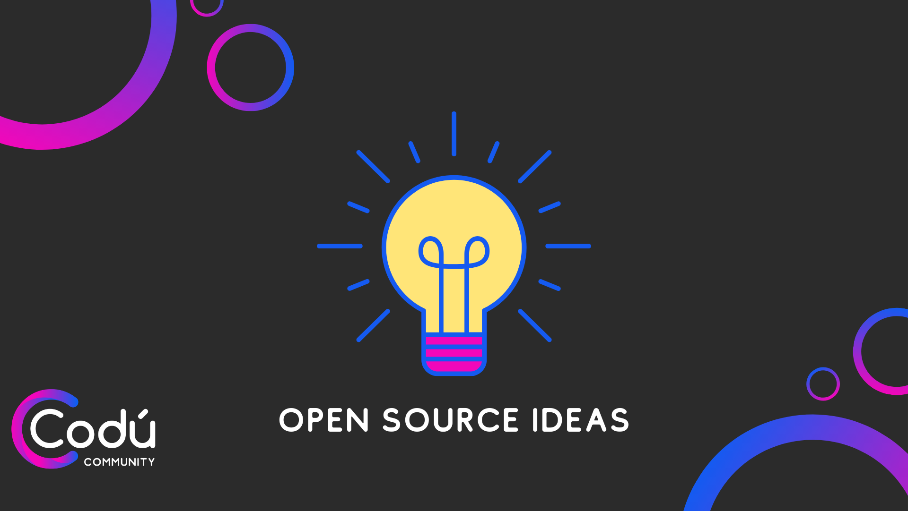

# Community Project Ideas :computer:

A place that we will organise and contribute ideas that could help the web

The Codú Community plans on being big :fish: in the OSS community.

Let's work together to brain storm and work together on projects to make each other better engineers, people and a fun place to be.

Ideas can be as simple as cheatsheets to production applications.

Each should project have the following **features**:

1. A clear and descriptive objective;
2. All the resources and links to help you find what you need to start the project

## Projects

Projects are divided into three tiers based on the knowledge and experience
required to complete them.

| ID | Project Idea Profile                                                                                                                                                |
| :--: | ---------------------------------------------------------------------------------------------------------------------------------------------------------------- |
|  1   | [HTML boilerplate generator](./projects/1.md).                                  |

## Contribution

Any contributions are highly appreciated. :pray: You can contribute in two ways:

1. create an issue and tell us your idea :bulb:. Make sure that you use the **new idea** label in this case;
2. fork the project and submit a PR with your new idea. Before doing that, please make sure that you read and follow the [Contribution Guide](./CONTRIBUTING.md);
